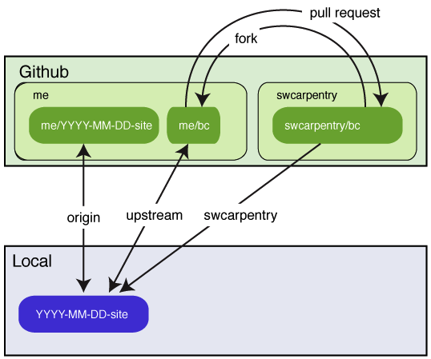

Contributing Boot Camp Material
===============================

Software Carpentry is an open source/open access project,
and we welcome contributions of all kinds.
By contributing,
you are agreeing that Software Carpentry may redistribute your work under
[these licenses](LICENSE.md).

Basic Instructions
------------------

We welcome improvements to the main `swcarpentry/bc` repository,
which is used as the template repository for new bootcamps.
New and improved lesson materials are particularly welcome.

Basic instructions for contributing are below.
Before beginning this workflow,
we recommend that you open an issue in the `swcarpentry/bc` Issue Tracker
to get feedback on your ideas and coordinate with other developers.

1.  Read the [README.md](README.md) file in this directory.

2.  Fork the `swcarpentry/bc` repository on GitHub.

3.  If you are beginning from a local `YYYY-MM-DD-site` repository
    (for example, from a bootcamp that you taught),
    make your fork of `bc` a remote named "upstream" within this repo using:

    ~~~
    git remote add upstream https://github.com/YOUR_NAME/bc.git
    ~~~

    (replacing 'YOUR_NAME' with your GitHub username).

    

    If you do not wish to start with a `YYYY-MM-DD-site` repository copy,
    clone a local copy of your `bc` fork
    and replace all instances of `upstream` in the instructions below with `origin`.

3.  If you have not done so already,
    add the main `swcarpentry/bc` repository as a remote named "swc":

    ~~~
    git remote add swc https://github.com/swcarpentry/bc.git
    ~~~

4.  Isolate the changes you want to share in a branch and push them to your fork on Github.
    If you are making new changes,
    replace the `git cherry-pick` line below with your various `git commit` commands:

    ~~~
    git fetch swc
    git checkout -b improvements swc/master
    git cherry-pick <commits related to improvements on your bootcamp's gh-pages branch>
    git push upstream improvements
    ~~~

    The `gh-pages` branch in the `swcarpentry/bc` repository
    is the "production" branch that provides the template for bootcamp teaching materials,
    while the `master` branch is used for development and integration.
    You should use `master` as the starting point for your improvements.

5.  Send a pull request to the `master` branch of `[swcarpentry/bc](http://github.com/swcarpentry/bc)`.

If it is easier for you to send them to us some other way,
please mail us at
[admin@software-carpentry.org](mailto:admin@software-carpentry.org).
Given a choice between you creating content or wrestling with Git,
we'd rather have you doing the former...

More Information
----------------

Software Carpentry uses a development workflow similar to that of many other open source projects.
For a graphical introduction to feature branches as we use them,
see GitHub's [workflow guide](https://guides.github.com/overviews/flow/).
For more information about getting started with Git,
see [our Git lesson](http://software-carpentry.org/v5/novice/git/index.html).

Acknowledgments
---------------

Software Carpentry could not exist without the hard work of
[our volunteers](team.md).
